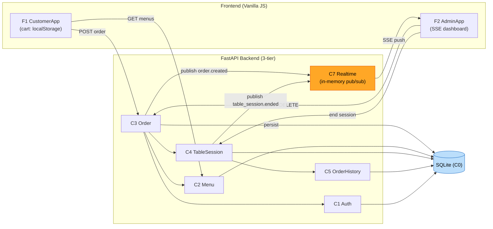

# Component Dependency (의존성 및 통신 패턴)

## 의존성 매트릭스
`✔` = 행 컴포넌트가 열 컴포넌트에 의존(호출)

| 의존 → ↓ 컴포넌트 | C0 Persistence | C1 Auth | C2 Menu | C3 Order | C4 TableSession | C5 OrderHistory | C7 Realtime |
|---|---|---|---|---|---|---|---|
| **C1 Auth** | ✔ | – | | | | | |
| **C2 Menu** | ✔ | | – | | | | |
| **C3 Order** | ✔ | ✔ | ✔ | – | ✔ | | ✔ |
| **C4 TableSession** | ✔ | | | | – | ✔ | ✔ |
| **C5 OrderHistory** | ✔ | | | | | – | |
| **C7 Realtime** | | | | | | | – |

- **가장 많이 의존받는 기반**: C0 Persistence(모든 도메인), C7 Realtime(주문/세션 이벤트).
- **오케스트레이션 허브**: C3 Order(Auth·Menu·TableSession·Realtime 협력).
- **순환 의존 없음**: OrderHistory는 TableSession에 의해 호출될 뿐 역방향 없음.

## 통신 패턴
- **동기(In-process 함수 호출)**: Router → Service → Repository, 서비스 간 협력.
- **비동기 이벤트(pub/sub)**: 상태 변화(주문 생성/상태변경/삭제, 세션 종료)를 C7 Realtime로 발행 → 관리자 SSE 구독자에게 push.
- **HTTP(REST)**: 프론트(F1/F2) ↔ 백엔드 Router.
- **SSE(text/event-stream)**: 백엔드 → AdminApp(F2) 단방향 실시간. 관리자 인증이 Bearer 헤더이므로 프론트는 **fetch 기반 스트리밍 리더**로 소비(native EventSource 미사용). 엔드포인트·SSE 요구사항은 불변.
- **클라이언트 로컬(localStorage)**: 장바구니(F1), 태블릿 인증 토큰 + 테이블 config(store_id/table_no), 관리자 토큰 저장. 태블릿은 저장된 토큰으로 새로고침/재진입 시 자동 로그인(FR-C1).

## 데이터 흐름 (핵심 vertical slice)

## 병렬 작업(4인) 관점 통합 지점
- **공유 계약(Contract)**: DB 스키마(C0), REST/SSE API 스펙, 이벤트 페이로드 형식.
- **선행 의존**: C0 Persistence + 공통 API/이벤트 계약이 먼저 안정화되어야 Order/TableSession 작업이 원활.
- **병렬 가능**: Menu(C2), 프론트 F1/F2, OrderHistory(C5)는 계약 확정 후 비교적 독립 작업 가능.
- 구체적 유닛 경계와 순서는 다음 단계(Units Generation)에서 확정.
