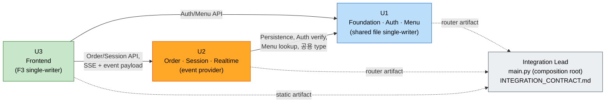

# Unit of Work Dependency (유닛 의존성 · provided/consumed interface 개요)

> 이 문서는 유닛 간 **의존 방향 + provided/consumed interface 개요**만 정의한다.
> **상세 API·schema·event 계약은 승인 후 별도 Integration Contract 단계에서 작성**한다 (Q4=C). 여기서는 제품 코드/상세 계약을 생성하지 않는다.

## 의존성 매트릭스
`✔` = 행 유닛이 열 유닛에 의존(consumed)

| 의존 →   ↓ 유닛 | U1 (Foundation·Auth·Menu) | U2 (Order·Session·Realtime) | U3 (Frontend) |
|---|---|---|---|
| **U1** | – | | |
| **U2** | ✔ | – | |
| **U3** | ✔ | ✔ | – |

- **기반 유닛**: U1(모두가 의존). **소비 전용**: U3(백엔드 API·SSE 소비, 아무도 U3에 의존하지 않음).
- **순환 의존 없음**: U1 → (없음), U2 → U1, U3 → U1·U2. 방향이 단방향(위상 정렬 가능).
- **entrypoint는 의존 그래프에 포함되지 않음**: `main.py`(composition root)는 도메인 유닛이 아니라 **Integration Lead**가 소유하며, 각 유닛이 제공한 router/static artifact를 **조립만** 한다. 따라서 "U1이 entrypoint를 통해 U2/U3에 의존"하는 관계가 생기지 않아 위 단방향 그래프와 충돌하지 않는다.

## Provided / Consumed Interface 개요

### U1 — Foundation · Auth · Menu
- **Provides**
  - Persistence/Repository 기반 (DB 연결·트랜잭션·스키마), 시드된 초기 데이터.
  - 인증 검증 의존성: `verify_admin_token → AdminContext`, `verify_tablet_token → TabletContext(store_id, table_no)`.
  - 인증 발급: 관리자 로그인, 태블릿 로그인(토큰 발급).
  - Menu 조회/관리 API (list/CRUD/reorder).
  - 공용 schema/type (공통 베이스, 표준 응답/에러 포맷).
- **Consumes**: 없음.

### U2 — Order Pipeline · Session · Realtime
- **Provides**
  - 주문 API: 생성, 현재 세션 조회, 상태 변경, 삭제.
  - 세션/이력 API: 테이블 setup, 세션 시작/종료, 총액, 과거 이력/날짜 필터.
  - SSE 스트림 endpoint(`GET /api/admin/orders/stream`, Bearer 보호) + **이벤트 발행(provider)**(`order.created`, `order.status_changed`, `order.deleted`, `table_session.ended`). *U2는 event provider / implementation owner이며, payload schema의 authoritative 계약은 Integration Lead의 `INTEGRATION_CONTRACT.md`에 있다. 스키마 변경은 U2의 Contract Change Request로 요청.*
- **Consumes (from U1)**
  - Persistence/Repository 기반, 공용 type.
  - `verify_tablet_token`(TabletContext = 고객 API 식별정보 Source of Truth), `verify_admin_token`.
  - Menu 단가/유효성 조회.

### U3 — Frontend (Customer · Admin · Shared JS)
- **Provides**: 정적 서빙 UI(고객 `/`, 관리자 `/admin`). F3 Shared JS는 **U3 내부 단독 소유**(외부 유닛이 쓰지 않음).
- **Consumes**
  - from U1: 관리자/태블릿 로그인, 메뉴 조회/관리 API.
  - from U2: 주문/세션/이력 API + SSE 스트림(fetch text/event-stream) + 이벤트 payload(계약은 Integration Lead 문서 기준).

### 통합 역할 (Integration Lead)
- 도메인 유닛과 별개 역할. **single-writer owns**: `main.py`(composition root), `INTEGRATION_CONTRACT.md`(REST/SSE API·공용 type·event payload의 authoritative 계약).
- U1 담당자와 동일인일 수 있으나 ownership 역할은 구분. 각 유닛은 자신의 router/static artifact만 제공하고 main.py를 수정하지 않는다.

## 병렬 개발 통합 지점 (Q4=C)
- 승인 후 **별도 Integration Contract 단계**에서 **Integration Lead**가 `INTEGRATION_CONTRACT.md`(DB schema, 공용 type, REST/SSE 스펙, event payload)를 single-writer로 확정하고 팀이 승인.
- 계약 승인 뒤 **U1·U2·U3 동시 착수**. U1은 지정 shared 파일 single-writer, Integration Lead는 main.py·계약 문서 single-writer 유지.
- event schema 변경은 U2의 **Contract Change Request** → Integration Lead 반영.
- 통합 검증 대상 = 핵심 vertical slice(메뉴 → 장바구니 → 주문 → 관리자 SSE → 상태 변경).

## 의존 흐름도

> 점선(`-.->`)은 각 유닛이 자신의 artifact를 **Integration Lead의 composition root에 제공(등록)** 함을 뜻하며, 도메인 유닛 간 런타임 의존이 아니다.
