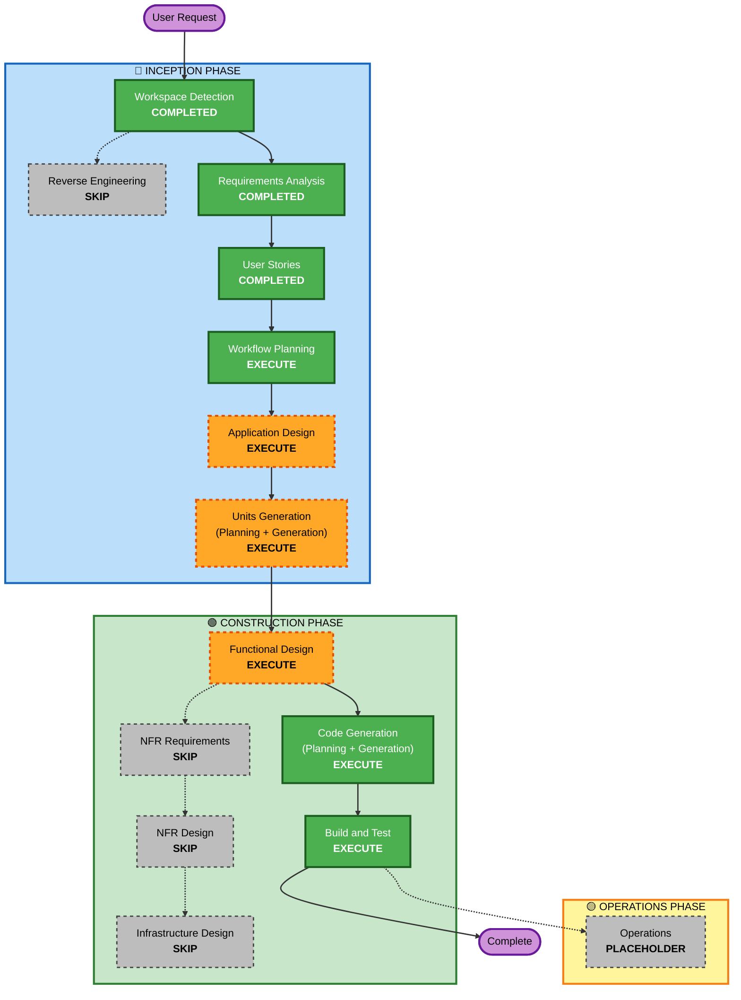

# Execution Plan (실행 계획)

## Detailed Analysis Summary

### Transformation Scope
- **Project Type**: Greenfield (신규 프로젝트, 기존 코드/인프라 없음)
- **Primary Changes**: 고객 웹UI + 관리자 웹UI + FastAPI 백엔드 + SQLite + SSE로 구성된 테이블오더 MVP 신규 구현

### Change Impact Assessment
- **User-facing changes**: Yes — 고객/관리자 두 웹UI 전반
- **Structural changes**: Yes — 신규 시스템 아키텍처 정의 필요
- **Data model changes**: Yes — Store/Menu/Table/Order/OrderItem/OrderHistory/Session 등 스키마 신규
- **API changes**: Yes — 고객·관리자 REST API + SSE 엔드포인트 신규
- **NFR impact**: Yes(최소 수준) — SSE 실시간(2초), JWT 16h 세션, bcrypt·로그인 시도 제한. *반나절 제약상 성능/확장성/HA/관측성은 확대하지 않음*

### Risk Assessment
- **Risk Level**: Medium — 다중 컴포넌트 + 세션/실시간/상태 로직, 단 범위는 MVP로 한정
- **Rollback Complexity**: Easy — 로컬 실행, 코드/DB 파일 기반
- **Testing Complexity**: Moderate — 핵심 vertical slice E2E + API/Contract 중심

## Workflow Visualization

## Phases to Execute

### 🔵 INCEPTION PHASE
- [x] Workspace Detection (COMPLETED)
- [x] Reverse Engineering (SKIPPED — greenfield, 기존 코드 없음)
- [x] Requirements Analysis (COMPLETED)
- [x] User Stories (COMPLETED)
- [x] Execution Plan (IN PROGRESS)
- [ ] Application Design — **EXECUTE**
  - **Rationale**: greenfield로 컴포넌트/서비스 경계, 도메인 모델, API 표면을 정의해야 하며, 이는 Units Generation의 병렬 분할과 통합 계약(contract)의 기반이 된다. (반나절 제약 → 경량/표준 깊이)
- [ ] Units Generation — **EXECUTE**
  - **Rationale**: 본 실습의 핵심 목표(유닛 분해 → 병렬 Construction). 4명이 병렬로 작업할 수 있도록 의존성과 통합 지점을 명시한 유닛으로 분해한다.

### 🟢 CONSTRUCTION PHASE (per-unit)
- [ ] Functional Design — **EXECUTE** (유닛별, 경량)
  - **Rationale**: 데이터 모델/스키마(주문·메뉴·테이블 이용 세션·OrderHistory), 세션 라이프사이클, 주문 상태 전이 등 비즈니스 로직 설계가 필요. 반나절 범위에 맞춰 핵심만.
- [ ] NFR Requirements — **SKIP**
  - **Rationale**: 기술 스택(FastAPI/SQLite/Vanilla JS/SSE)이 이미 확정되었고 NFR은 요구사항에 최소 수준으로 명시됨. production NFR 확대 금지 지침 반영. 명시 NFR(SSE 2초, JWT 16h, bcrypt, 로그인 시도 제한)은 Functional Design/Code Generation에서 인라인 처리.
- [ ] NFR Design — **SKIP**
  - **Rationale**: NFR Requirements를 건너뛰므로 함께 생략. 별도 NFR 패턴 설계 불필요.
- [ ] Infrastructure Design — **SKIP**
  - **Rationale**: 로컬 실행만(단일 명령 기동), 클라우드/컨테이너/배포 인프라 범위 제외.
- [ ] Code Generation — **EXECUTE (ALWAYS)**
  - **Rationale**: 유닛별 구현 계획 및 코드 생성.
- [ ] Build and Test — **EXECUTE (ALWAYS)**
  - **Rationale**: 전 유닛 빌드, 단위/통합/핵심 흐름 검증.

### 🟡 OPERATIONS PHASE
- [ ] Operations — PLACEHOLDER

## Estimated Timeline
- **Total Stages to Execute**: 8 (WD·RA·US·WP 완료 포함, 남은 실행: AD, UG, per-unit[FD+CG], BT)
- **Estimated Duration**: 약 반나절 (실습). Inception 마무리(AD+UG) → 병렬 Construction → 통합 → Build/Test.

## Success Criteria
- **Primary Goal**: 핵심 vertical slice가 end-to-end 동작하는 MVP — 메뉴 조회 → 장바구니 → 주문 생성 → 관리자 주문 확인(SSE) → 주문 상태 변경.
- **Key Deliverables**: 동작하는 FastAPI 백엔드 + SQLite + 고객/관리자 Vanilla JS UI + 시드 데이터 + 로컬 실행 방법 + 기본 테스트.
- **Quality Gates**:
  - 핵심 흐름 E2E 수동/자동 검증 통과
  - 주요 API 계약(Contract) 및 상태 전이/세션 라이프사이클 검증
  - constraints 제외 항목 미구현 확인, 요구사항 명시 보안(JWT/bcrypt) 구현 확인
